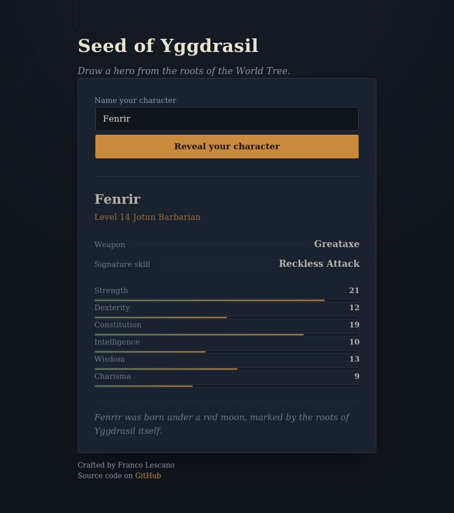

# Seed of Yggdrasil

A procedural, Norse-inspired RPG character generator. Enter a name and draw a random hero — race, class, weapon, signature skill, attributes, and a short saga fragment — pulled from the roots of the World Tree.

🔗 **Live demo:** [seed-of-yggdrasil.vercel.app](https://seed-of-yggdrasil.vercel.app/)



## Features

- Procedural character generation across 6 races and 9 classes, each carrying its own stat bonuses, weapons, and signature skills.
- Rule-based pairing: every race only rolls classes that fit its lore (an Elf never comes out as a Barbarian), instead of pure randomness across the full list.
- Six core attributes (Strength, Dexterity, Constitution, Intelligence, Wisdom, Charisma) rolled per character and visualized with proportional bars.
- Randomized saga fragments for a bit of narrative flavor on every roll.
- Fully static front end — no build step, no backend, no dependencies.
- Responsive layout, keyboard-accessible form, and a reduced-motion fallback for the reveal animation.

## How it works

1. `generateCharacter()` picks a random race, then a random class **from that race's allowed list** (`races[race].classes`) — this is what keeps every result lore-consistent.
2. Each of the six attributes is rolled independently (`rollStat()`, range 8–19), then the race's stat bonuses are added on top.
3. Weapon and signature skill are drawn from the chosen class's pool (`classes[class].weapons` / `.skills`).
4. A saga fragment is picked at random and stitched together with the character's name for the closing flavor text.
5. `main.js` takes that plain JS object and renders it into the DOM, animating the result card into view.

Because races, classes, weapons, skills, and saga text all live in one place (`js/data.js`), adding a new race or class is a matter of extending that file — no changes needed elsewhere.

## Tech stack

- HTML5 (semantic structure)
- CSS3 (custom design system with CSS variables — no framework)
- Vanilla JavaScript (ES6+, DOM manipulation, no libraries)
- Fonts: [Cinzel](https://fonts.google.com/specimen/Cinzel) and [EB Garamond](https://fonts.google.com/specimen/EB+Garamond) via Google Fonts

## Project structure

```
├── index.html
├── css/
│   └── style.css
├── js/
│   ├── data.js        # races, classes, and saga text
│   ├── generator.js   # character generation logic
│   └── main.js        # DOM wiring / UI behavior
└── assets/
    └── screenshot.jpg
```

## Running locally

No build tools required. Either:

1. Open `index.html` directly in a browser, or
2. Serve it locally for a cleaner experience:
   ```bash
   npx serve .
   ```

## Deploying

This is a static site, so it deploys as-is to any static host:

- **Vercel:** import the repo at [vercel.com/new](https://vercel.com/new) — no configuration needed.
- **Netlify:** drag-and-drop the folder at [app.netlify.com/drop](https://app.netlify.com/drop), or connect the repo.

## Roadmap

Ideas for future iterations:

- [ ] "Reroll" button to generate a new character without retyping the name
- [ ] Downloadable/shareable character card (PNG export)
- [ ] More races and classes, including hybrid multiclass results
- [ ] Persist the last generated character in the URL for sharing a direct link

## License

MIT — feel free to fork this and build your own realms on top of it.

## Author

**Franco Lescano** — [GitHub](https://github.com/LescanoFranco123)
